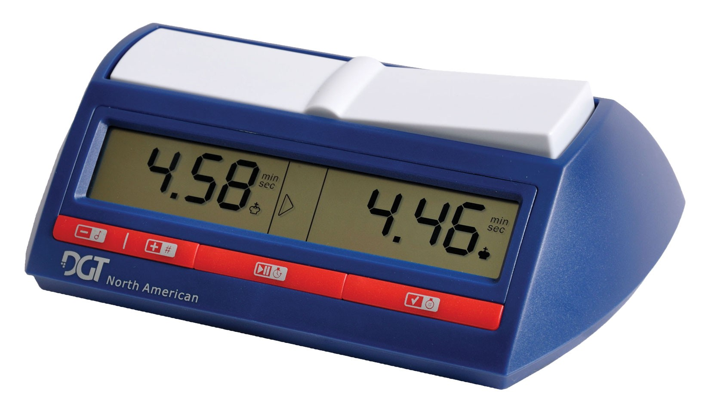

# The clock
In a game of chess, a clock is used to keep track of the remaining time for each player. When the time drops down to zero, the player loses the game.

## Specific
1. When the clock is turned on, the remaining time will be 5 minutes for both players. The clock is paused when it's turned on (i.e. the time is not decreasing);
2. When the clock is started, the time will start decreasing for the white player;
3. When the clock is paused, the time won't decrease;
4. When a paused clock is started again, time will resume decreasing for the current player;
5. When a player ends a turn, his/her time won't decrease anymore. Instead, the other player's time will start decreasing since it's their turn;
6. When the clock is reset, the time will be set to 5 minutes and the clock is paused (time is not decreasing);
7. *Nice-to-have*: If you try to start a clock that's not been turned on, an exception should occur (e.g. `throw new InvalidOperationException("You must turn it on first");`). The exception will halt the exceution of the application and will let developers know how the `Clock` class is supposed to be used. You can consider this as a form of documentation;
8. *Nice-to-have*: Raise the event `TimeExpired` when the time of a played reaches zero.

## A sample of a real chess clock to keep as a reference while implementing the Clock class
This clock has:
* Two buttons for changing the tone and the volume of the buzzer (which are irrelevant to us and which we won't implement in the Clock class);
* A single button to toggle between the Started and Paused states;
* A reset button;
* A back button (not visible here) to turn the clock on. The clock turns off on its own after a few minutes of inactivity;
* A big rocking button used to end a player's turn. In this picture, it's the black player's turn (his/her time is decreasing).
